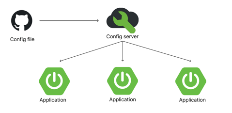

# config server

## 수업 환경 정보
- jdk (Temurin-21.0.1+12)
- config-server 4.10
- boot 3.2

### Config server 등장 배경
서비스가 발전하게 되면서 다수의 사용자 요청을 감당하기 위해 MSA라는 아키텍처가 탄생하게 되었다.  
MSA는 마이크로 서비스 아키텍처로 도메인 단위로 서버를 분리하여 특정 서버가 멈춰도 서비스 전체에 영향도를 낮추기 위한 방식으로 고안된 아키텍처이다.  
이러한 방식의 서비스를 이용하여 다수의 사용자 요청을 감당할 수 있는 서버를 구축할 수 있게 되었지만 이로인해 많은 작업의 리소스가 발생하게 된다.  
그 중 이번 챕터에서 알아볼 config server는 이러한 작업의 효율성 증가를 위하 고안된 분산 시스템 설정 관리 방법 중 하나이다.  

#### Config Server란?
MSA는 여러 개의 작은 서버를 두어 다수의 요청 트래픽 감당이 가능한 서비스를 구축하기 위한 아키텍처임을 소개하였다.  
config server는 이렇게 많아지는 서버의 설정 정보를 각각의 관리하는 방식이 아닌 한 곳에서 설정 정보를 관리할 수 있도록 하여  
여러개의 서버에 개별적인 환경을 구성하는 방식이 아닌 한번에 관리할 수 있도록 하는 중앙설정 관리 방식이다.  
이러한 config server를 이용하게 되면 가질 수 있는 이점으로 개별적으로 관리해야 하는 서버의 설정 정보를 한번에 할 수 있어 편리하며  
각각의 서버가 config server의 설정을 구독하는 방식이기 때문에 가동 중인 서버의 서드파티 정보 및 데이터베이스, 설정 변수 값 등을 서버의 중단없이 배포하는 것이 가능하다.  
(참고 카카오 선물하기의 경우 11월 11일을 기점으로 기존 서버에 1000의 서버를 추가 증설한다고 함)

#### Config Server Architecture

